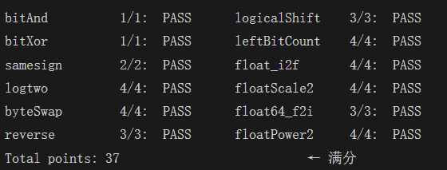

# datalab 报告

姓名：邵聪

学号：2025201691

| 项目 | 得分 | 项目 | 得分 |
| --------- | ------------- | ------------- | ------------- |
| bitAnd | 1/1 | logicalShift | 3/3 |
| bitXor | 1/1 | leftBitCount | 4/4 |
| samesign | 2/2 | float_i2f | 4/4 |
| logtwo | 4/4 | floatScale2 | 4/4 |
| byteSwap | 4/4 | float64_f2i | 3/3 |
| reverse | 3/3 | floatPower2 | 4/4 |
| **总分** | **37/37** | | |

test 截图：



## 解题报告

### 亮点

按我自己觉得实现得最干净的程度排序：

1. `logicalShift` —— 用掩码把 `n == 0` 的情形短路，绕开了 `>> -1` 这个未定义行为
2. `leftBitCount` —— 题目不给 `-`，用 `+ ~c` 造出减法的同时保持五步二分
3. `byteSwap` —— 异或挖空再或入的对称写法，不用构造两套掩码
4. `floatScale2` —— 非规格化数乘 2 用整体左移一位实现，规格化边界自动接管
5. `float_i2f` —— 舍入部分完整实现了 round-to-even，并处理了进位后重新归一化

下面按这个顺序展开。

### logicalShift

```c
int z = !n;
int keep = z + ~0;                  // n == 0 时 keep = 0，否则全 1
int s = (n + ~0) & keep;            // n - 1，但 n == 0 时不产生 -1
int fill = ~(0x7FFFFFFF >> s) & keep;
return (x >> n) & ~fill;
```

算术右移 `x >> n` 会在高 n 位补上符号位，所以要构造一个"高 n 位为 1、其余为 0"的掩码把它清掉。

关键在于 `0x7FFFFFFF >> (n - 1)` 这一步：`0x7FFFFFFF` 的最高位是 0，算术右移 `n - 1` 位后正好高 n 位全是 0，取反即得掩码。但题目允许 `n == 0`，此时 `n - 1 == -1`，移位量为负是未定义行为。

我的做法是不给 `n == 0` 单独开分支，而是用 `keep` 把整个计算一起压掉：`n == 0` 时 `keep` 为 0，`s` 和 `fill` 都被清零，函数直接退化成 `x >> 0`。这样代码没有分支，也不需要额外的 `if`。

用了 12 个运算符，上限 20。

### leftBitCount

```c
int y = ~x, c = 0;
int t1 = !(y >> 16);            c = c + (t1 << 4);
int t2 = !(y >> (25 + ~c));     c = c + (t2 << 3);
int t3 = !(y >> (29 + ~c));     c = c + (t3 << 2);
int t4 = !(y >> (31 + ~c));     c = c + (t4 << 1);
int t5 = !(y >> (32 + ~c));     c = c + t5;
int t6 = !y;                    c = c + t6;
```

统计 `x` 左边连续 1 的个数，等价于统计 `y = ~x` 左边连续 0 的个数。二分地判断"左边前 k 位是否全为 0"：`! (y >> (32 - k))` 为真就说明前 k 位全 0，把 k 累加进 `c`，接下来从 `c + 8`、`c + 4`、`c + 2`、`c + 1` 依次试探。

两个细节：

- 本题的 `Legal ops` 里没有 `-`，所以 `shift = 24 - c` 只能写成 `25 + ~c`（`~c == -c - 1`）。写成 `-` 会被判违规。
- 第五步试探 `c + 1` 时 `c` 最大是 30，移位量 `31 - c` 最小为 1，不会出现移位 0 位以上的未定义行为；全 1 的情况由最后的 `!y` 单独补上 32。

用了 30 个运算符，上限 50。

### byteSwap

```c
int nb = n << 3, mb = m << 3;
int a = (x >> nb) & 0xFF;
int b = (x >> mb) & 0xFF;
return (x ^ (a << nb) ^ (b << mb)) | (a << mb) | (b << nb);
```

思路是先"挖空"再"填入"：同一个值异或两次等于没做，所以前面那串异或等于把第 n、m 个字节清成 0；后面两个或项再把 `a`、`b` 放到对方的位置上。

这种写法的好处是不需要为两个字节分别构造 `~mask`，代码短且对称。并且题目没有排除 `n == m`：此时 `a == b`，挖空后填回去的仍是原有的字节，结果自然退化为 `x`，不用特判。

用了 14 个运算符，上限 17。

### floatScale2

```c
if (exp == 0xFF) return uf;                     // NaN / Inf
if (exp == 0)    return sign | (uf << 1);       // 非规格化
if (exp == 0xFE) return sign | 0x7F800000;      // 即将上溢
return sign | ((exp + 1) << 23) | (uf & 0x7FFFFF);
```

浮点数乘 2 直觉上就是指数加 1，但三种边界情形要单独处理：

- `exp == 0xFF`：NaN 按题目要求返回参数本身，Inf 乘 2 仍是 Inf，也返回参数本身，可以合并。
- `exp == 0`：非规格化数的指数固定是 `1 - 127`，不能被加。乘 2 等价于把整个位模式左移一位 —— 尾数左移后若最高位为 1，这一位正好落进指数字段的最低位，非规格化到规格化的过渡由硬件表示法自动完成，不需要我判断。`uf << 1` 会把符号位挤出去，所以再用 `sign` 或回来。
- `exp == 0xFE`：指数加 1 会得到 `0xFF`，即溢出为 Inf，直接返回 `sign | 0x7F800000`。

用了 14 个运算符，上限 30。

### float_i2f

```c
while (!(ax & 0x80000000)) { ax = ax << 1; e = e - 1; }  // 归一化，e 从 31 递减
int m = ax & 0xFF;      // 被截断的低 8 位
ax = ax >> 8;           // 剩下 1 位隐含位 + 23 位尾数
if (m > 0x80) ax = ax + 1;
else if (m == 0x80) {
    if (ax & 1) ax = ax + 1;                            // 恰好一半，向偶
}
if (ax & 0x1000000) { ax = ax >> 1; e = e + 1; }        // 进位溢出，重新归一化
```

`x == 0` 单独返回 0；否则取符号、负数取绝对值，然后不断左移把有效位顶到最高位，移位次数决定无偏指数 `e`。

舍入部分是把低 8 位切下来单独判断：最高位（`0x80`）是 round bit，低 7 位是 sticky。`m > 0x80` 表示被舍掉的部分大于半个 ULP，进位；`m == 0x80` 是正好一半，按 IEEE 754 的默认规则取偶（尾数最低位为 1 才进位）；其余舍去。

最后一个 `if` 容易被漏掉：尾数进位可能把它顶到第 24 位，也就是隐含位进了一位，这时必须把尾数右移回去、指数加 1，否则尾数会越界污染指数字段。

用了 22 个运算符，上限 30。

### 其余题目简述

- **bitAnd**：`~(~x | ~y)`，德摩根律直接展开。
- **bitXor**：`~(~x & ~y) & ~(x & y)`，即 `(x | y) & ~(x & y)`，用德摩根把 `|` 换成 `~` 和 `&`。刚好 7 个运算符，卡满上限。
- **samesign**：题目规定 0 既不是正数也不是负数，`samesign(0, 0) == 1` 但 `samesign(0, 1) == 0`，所以要先 `if (x && y)` 分流。两者都非零时比较符号位 `!(x >> 31 ^ y >> 31)`；有零时只有全零才同号，即 `!(x ^ y)`。
- **logtwo**：对 `v > 0` 二分求最高位位置，依次试探前 16、8、4、2、1 位。移位量写成 `r | 8` 而不是 `r + 8`，因为 `r` 已确定的低位都是 0，两者等价，而 `|` 在此题的合法运算符里。
- **reverse**：循环 32 次，每次把结果左移一位并接上 `v` 的最低位，`v` 右移一位，共 5 个运算符。
- **float64_f2i**：拆出符号位和 11 位指数。`exp < 1023` 说明 |值| < 1，向零取整为 0；`exp > 1054` 说明 ≥ 2^31，溢出返回 `0x80000000`。中间情况把 52 位尾数（含隐含位）拼成 32 位中间量 `m`，再右移 `1054 - exp` 位 —— 右移天然实现向零取整。符号恢复时负数一侧的溢出阈值是 `m > 0x80000000`，因为 `-2^31` 仍是合法结果。
- **floatPower2**：按结果落在规格化区、非规格化区、溢出/下溢分成三档。`x >= -126` 时指数字段为 `x + 127`；`-149 <= x < -126` 时是非规格化数 `2^(x+149) * 2^-149`，位模式就是 `1 << (x + 149)`；再小返回 0，`x > 127` 返回 `+INF`。

## 反馈/收获/感悟/总结

<!-- 这一节我按你的作答情况起草了一版，请按你的真实感受改，不想写可以整节删掉 -->

这次实验最直接的收获是把"移位"从一个抽象的运算符变成了需要时刻留意边界的东西：`>>` 的移位量一旦超出 `[0, 31]` 或落到负数就是未定义行为，`logicalShift` 里 `n == 0` 和 `leftBitCount` 里逐步累加的移位量都必须先把值域算清楚才能动手。浮点数部分则是第一次逐位拆开 IEEE 754 的符号、阶码、尾数三段，尤其是 `floatScale2` 里非规格化数乘 2 靠整体左移、由位模式自己完成规格化，比预想的干净。难度上我认为浮点题明显高于整数题，整数题更多是熟练度，浮点题要真正想清楚每一个边界。

## 参考的重要资料

<!-- 如果你用了 AI 工具或者看过博客，请补在这里，助教需要知道 -->

- 《深入理解计算机系统》（CSAPP，第 3 版）第 2 章「信息的表示和处理」：补码运算、位级运算、IEEE 754 浮点格式与舍入规则
- 本实验模板仓库 [RUCICS/Datalab-2025Fall](https://github.com/RUCICS/Datalab-2025Fall) 的 README，其中对合法运算符、运算符计数方式的规定
- IEEE 754-2019 标准中 round-to-nearest-even（就近舍入取偶）的约定
